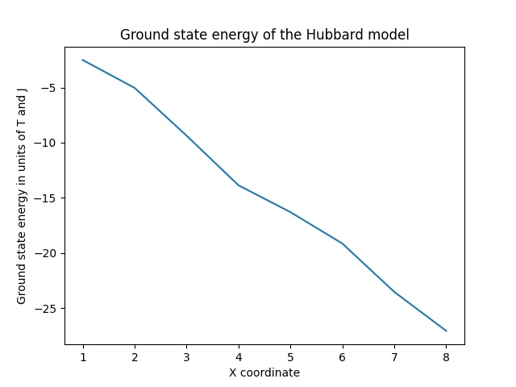
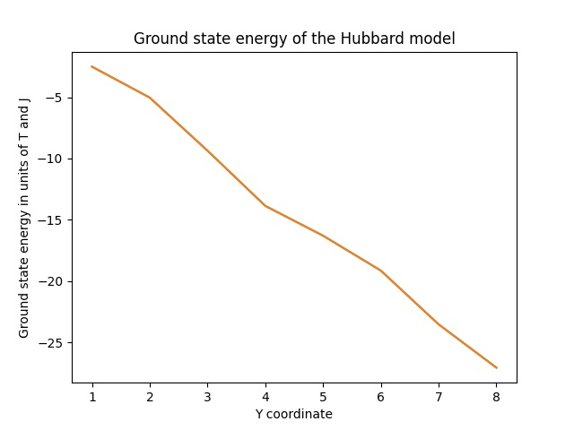
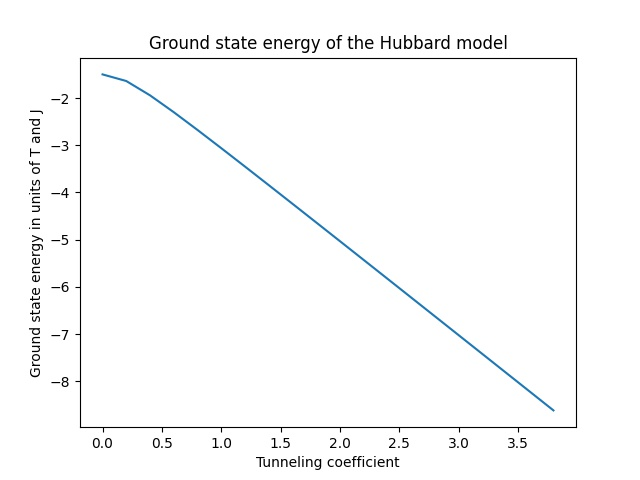

# Fermale

<p align="center">
  
</p>

Fermale (which stands for **fer**mionic systems for **ma**chine **le**arning) is an exploratory project for testing ways in which fermionic systems can be applied to solve machine learning problems.

## Setting up environment

To create a conda environment and install all required dependencies execute the following command:

```sh
conda create -f environment.yml
```

## Launching

To run supported commands active the environment created on setup and execute desired operation:

```sh
python -m fermale test-operators-initialization -c 1.7
```

## Some results



